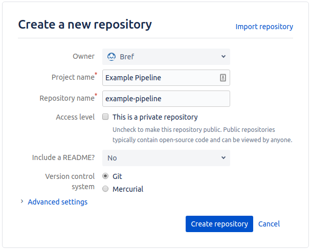
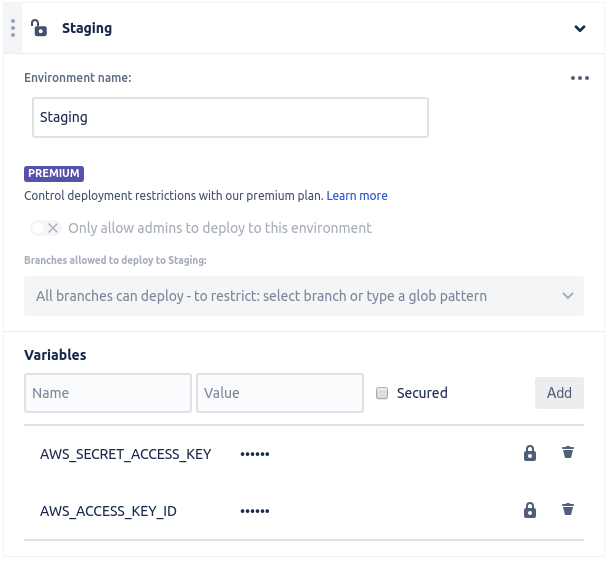
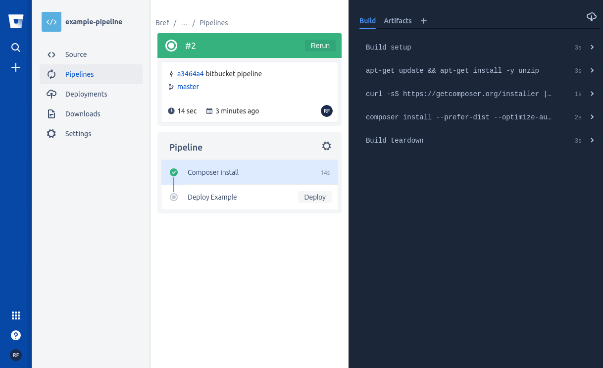
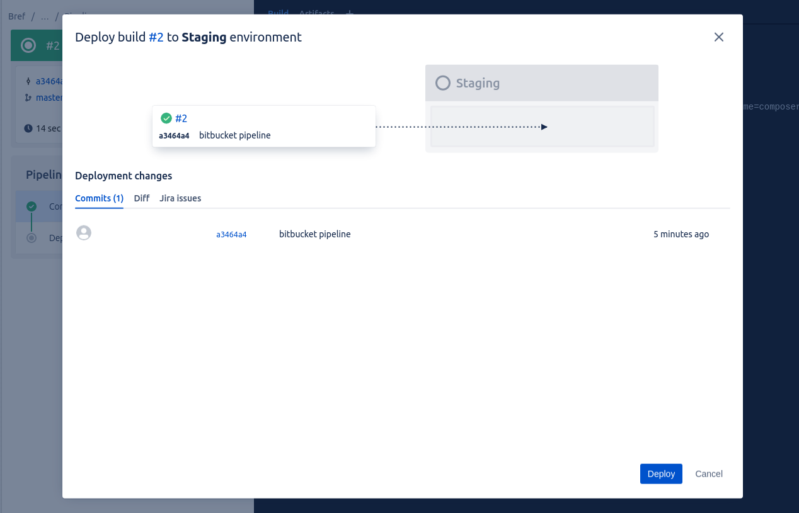

# Requirements

* Repository Bitbucket

 
 
* Application configured to deploy with serverless brefphp

# Step by step

## Bitbucket Configuration

* Go to the "Settings -> Pipelines -> Settings" menu and enable Pipeline:

 
* Access the menu "Settings -> Pipelines -> Deployments"
    - Select the environment you want to deploy (Staging or Production), in this example I will use Staging
    - Add the variables
        * AWS_CREDENTIAL_KEY: Access Key ID
        * AWS_CREDENTIAL_SECRET: Secret Key
  


## Project configuration

* In the root directory of your project create the file `bitbucket-pipelines.yml`:
```
pipelines:
  branches:
    master: # Whenever there is a push on the master branch
      - step: # Step 1: Using a docker php image to install composer and download your project dependencies
          name: Composer install
          image: php:7.3
          caches:
            - composer
          script:
            - apt-get update && apt-get install -y unzip
            - curl -sS https://getcomposer.org/installer | php -- --install-dir=/usr/local/bin --filename=composer
            - composer install --prefer-dist --optimize-autoloader --no-dev
          artifacts: # artifacts generated during composer install should be moved to the next step
            - vendor/**
            - bootstrap/cache/*.php
      - step:
          # Step 2: Using the docker node image
          #  - install serverless
          #  - inject credentials using previously configured variables
          #  - deploy
          name: Deploy Example
          deployment: staging # WARNING: here you define which deploy variables will be injected into the container according to the previously configured environment.
          image: node:11.13.0-alpine
          trigger: manual
          caches:
            - node
          script:
            - apk add python3
            - npm install -g serverless
            - serverless config credentials --stage prod --provider aws --key ${AWS_DEV_LAMBDA_KEY} --secret ${AWS_DEV_LAMBDA_SECRET}
            - serverless deploy --stage dev
```

## Deploy

* When you push your master branch automatically the pipeline will start
* The first step will start automatically.

* To start the second step you need to click the deploy button



# Comments

* To make the second step automatic, just remove the `trigger: manual` command from the`bitbucket-pipelines.yml` file
* In the example we use a docker _php:7.3_ and _node:11.13.0-alpine_ image, use the image that suits you best.